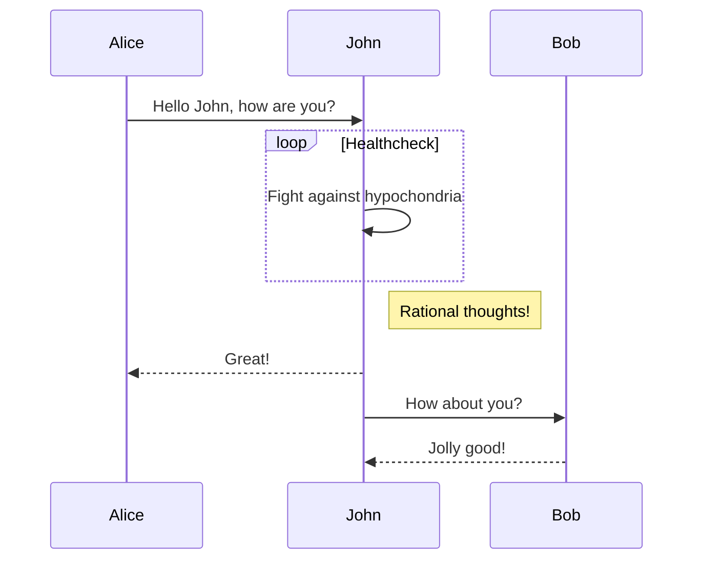

最开始我是在[CSDN](https://blog.csdn.net/w_weilan)上写博客的。博客写了一年多，访问量勉强破万，感觉其中至少有三成是自己贡献的。而且 CSDN 上的广告是越来越多，网页编辑器也是越来越不好用。

十一月份，在青岛的 ICPC 区域赛失利之后，想要重新开始，和过去告别。也从此转移自己写博客的阵地。考虑过转投暂时还比较干净而且可以部分定义页面的[博客园](https://www.cnblogs.com/wu-kan/)，但是最终还是决定在[Github Pages](https://pages.github.com/)上搭建属于自己的博客。

然后，翻了一些网上的教程，用[Hexo](https://hexo.io/zh-cn/)框架和[NexT](https://github.com/theme-next/hexo-theme-next)主题搭了一个比较素雅的符合个人审美的博客。然而，Hexo 搭建的博客需要先在本地生成博客页面然后再上传到服务器上，每次发博客都需要在电脑重新生成页面并上传，感觉没有那么方便。在不同电脑上想要发博客更是十分困难，感觉如果胡乱操作后本地部署的文件发生了一定的错乱，恢复起来会十分麻烦。

后来发现，Github Pages 原生支持[Jekyll](https://www.jekyll.com.cn/)，因此如果只需要推送文章可以直接在 github 的仓库里做。于是决定在期末考试后用 Jekyll 重新搭建个人博客。原来的博客不再维护。

## 构思

目前博客的 demo 如下：


想搭建一个足够干净、页面几乎不要有多余元素的博客，同时博客的功能还要足够丰富，满足我以下的需求：

- [x] 用 Markdown 写博客
- [x] 支持 Latex 公式
- [x] 支持 mermaid 等插件
- [x] 个性化 Live2D
- [x] 分享一些我在其他网站的个人账号
- [x] 移动端适配
- [x] 足够快的加载速度
- [x] 访问量统计，评论互动
- [ ] 需求是会逐渐增长的！

其中，Live2D 是我某次访问别人的博客初次见到的，感觉非常吸引人。最终的目标是去掉网页上所有多余的元素，只剩下博文和 Live2D 看板娘，看板娘本身还可以作为博客访问的导航，感觉会十分有新意。

## 搭建过程（不定期更新）

我目前读的专业是计科超算方向，所以软件工程专业相关方面的基础几乎为 0😌，大部分的内容都是参考网上教程慢慢摸索的，假如对某些过程有意见和建议欢迎向我提出！

### 开发环境

我的博客前端后端分离，本地只需要下载后端博文文件即可，前端部分使用 jekyll-remote-theme 远程引用。这个学期选了一门 Linux 相关的公选课，感觉还不错，因此直接把开发环境是搭建在 Windows Subsystem for Linux（简称 WSL）上了，Windows 下也可以直接访问其中的环境，详见[这篇博客](https://wu-kan.cn/_posts/2018-12-14-Windows-Subsystem-for-Linux/)。

```bash
sudo apt install -y ruby ruby-dev make gcc g++ zlib1g-dev
# gem sources --add https://gems.ruby-china.com/ --remove https://rubygems.org/
sudo gem install github-pages
git clone --depth=1 https://github.com/wu-kan/wu-kan.github.io
cd wu-kan.github.io
github-pages build --destination _site
```

jekyll 博客是基于 ruby 语言开发的，要先将 ruby 装进来。此外，国内访问一些资源可能会很慢，推荐去掉上面的注释，使用国内镜像。

github 上的 jekyll 和普通的 jekyll 是有一点点区别的，比如说只支持特定的插件。我希望与 github 保持兼容，因此配置的依赖是直接引入了 github 版本的 jekyll，安装时间略久。

我在一个全新的 Linux 中安装了一遍，需要的依赖已经在上面的「开发环境中列出来的」。如果`bundle install`在你的机器上还是报错，要看报错信息，缺啥装啥。


```shell
jekyll s
```

由于我的博客已经达到了三百篇以上，在本地生成网页的速度有些慢，在我的机器上要跑三分钟（关掉配置项中的侧边栏总字数统计就快了，可达 25s）。

```shell
    Server address: http://127.0.0.1:4000/
  Server running... press ctrl-c to stop.
```

看到如上内容时就成功了，本地访问<http://127.0.0.1:4000/>即可查看效果。

### 定制

我把博客实现的的插件基本上都封装起来了，可以直接在浏览器按 F12 查看我是怎么引入的。如果你想增加新的渲染规则，可以新建`_layouts`目录，将你自己的渲染规则放进去，见[目录结构 -Jekyll](http://jekyllcn.com/docs/structure/)。

#### 加入看板娘

##### 摇摇乐

见 [dsrkafuu/sakana-widget](https://github.com/dsrkafuu/sakana-widget)。

```html
<link
  rel="stylesheet"
  href="https://cdn.jsdelivr.net/npm/sakana-widget@2.7.0/lib/sakana.min.css"
/>
<script>
function initSakanaWidget() {
  const mizuno = SakanaWidget.getCharacter('takina');
  mizuno.image = `https://mizuno-ai.wu-kan.cn/pixiv/75805052_p0.webp`;
  SakanaWidget.registerCharacter('mizuno', mizuno);
  let sakana = document.createElement("div");
  sakana.style.bottom = "0";
  sakana.style.right = "0";
  sakana.style.zIndex = "1";
  sakana.style.position = "fixed";
  document.body.insertAdjacentElement("beforeend", sakana);
  new SakanaWidget({ character: 'mizuno' }).mount(sakana);
}
</script>
<script
async
onload="initSakanaWidget()"
src="https://cdn.jsdelivr.net/npm/sakana-widget@2.7.0/lib/sakana.min.js"
></script>
```

##### Live2D（以前使用）

参考了：

- [网页添加 Live2D 看板娘](https://www.fghrsh.net/post/123.html)。
- [在网页中添加 Live2D 看板娘](https://zhangshuqiao.org/2018-07/%E5%9C%A8%E7%BD%91%E9%A1%B5%E4%B8%AD%E6%B7%BB%E5%8A%A0Live2D%E7%9C%8B%E6%9D%BF%E5%A8%98)
- [给你的博客增加动态看板娘](https://paugram.com/coding/add-poster-girl-with-plugin.html)

由于 live2d 的协议是 GPL，这里我不把它的源码拷贝到自己的博客项目了，直接用链接引入。在 html 的任意位置，或是我博客对应的`append`选项下插入下述 html 代码：

```html
<link
  rel="stylesheet"
  href="https://cdn.jsdelivr.net/gh/Dreamer-Paul/Pio@2.4/static/pio.min.css"
/>
<script
  defer="defer"
  src="https://cdn.jsdelivr.net/gh/Dreamer-Paul/Pio@2.4/static/l2d.min.js"
></script>
<script
  defer="defer"
  src="https://cdn.jsdelivr.net/gh/Dreamer-Paul/Pio@2.4/static/pio.min.js"
  onload='
    if (screen.width > screen.height)
    {
      let pio_container = document.createElement("div");
      pio_container.classList.add("pio-container");
      pio_container.classList.add("right");
      document.body.insertAdjacentElement("beforeend", pio_container);
      let pio_action = document.createElement("div");
      pio_action.classList.add("pio-action");
      pio_container.insertAdjacentElement("beforeend", pio_action);
      let pio_canvas = document.createElement("canvas");
      pio_canvas.id = "pio";
      pio_canvas.style.width = "14rem";
      pio_canvas.width = "600";
      pio_canvas.height = "800";
      pio_container.insertAdjacentElement("beforeend", pio_canvas);
      let pio = new Paul_Pio({
        "mode": "draggable",
        "hidden": true,
        "content": {
          "skin": ["要换成我的朋友吗？", "让她放个假吧~"],
          "custom": [{
            "selector": "a",
            "type": "link",
          }, {
            "selector": ".sidebar-toggle",
            "text": "打开侧边栏叭~"
          }, {
            "selector": ".effect-info",
            "text": "哇，你发现了什么！"
          }, {
            "selector": "#sidebar-search-input",
            "text": "想搜索什么呢？很多干货哦！"
          }, {
            "selector": "#toc",
            "text": "这是目录~"
          }, {
            "selector": ".page-title",
            "text": "这是标题~"
          }, {
            "selector": ".v",
            "text": "评论没有审核，要对自己的发言负责哦~"
          }]
        },
        "model": [
          "https:\/\/cdn.jsdelivr.net/gh/imuncle/live2d/model/33/model.2018.bls-winter.json",
          "https:\/\/cdn.jsdelivr.net/gh/imuncle/live2d/model/platelet-2/model.json",
          "https:\/\/cdn.jsdelivr.net/gh/imuncle/live2d/model/xiaomai/xiaomai.model.json",
          "https:\/\/cdn.jsdelivr.net/gh/imuncle/live2d/model/mashiro/seifuku.model.json",
          "https:\/\/cdn.jsdelivr.net/gh/imuncle/live2d/model/seele/model.json",
          "https:\/\/cdn.jsdelivr.net/gh/imuncle/live2d/model/Violet/14.json",
          "https:\/\/cdn.jsdelivr.net/gh/xiaoski/live2d_models_collection/Kobayaxi/Kobayaxi.model.json",
          "https:\/\/cdn.jsdelivr.net/gh/xiaoski/live2d_models_collection/mikoto/mikoto.model.json",
          "https:\/\/cdn.jsdelivr.net/gh/xiaoski/live2d_models_collection/uiharu/uiharu.model.json"]
      });
    }'
></script>
```

自定义参数见[Dreamer-Paul/Pio](https://github.com/Dreamer-Paul/Pio)，模型收集自[imuncle/live2d](https://github.com/imuncle/live2d)和[xiaoski/live2d_models_collection](https://github.com/xiaoski/live2d_models_collection)，。

#### $\KaTeX$

参考：

- [使用 KaTeX 代替 MathJax 渲染公式](https://www.jianshu.com/p/f2b28954d902)。
- [Auto-render Extension · Katex](https://katex.org/docs/autorender.html)

```html
<link
  rel="stylesheet"
  href="//cdn.jsdelivr.net/npm/katex@0.12.0/dist/katex.min.css"
/>
<script
  src="//cdn.jsdelivr.net/npm/katex@0.12.0/dist/katex.min.js"
  defer="defer"
></script>
<script
  src="//cdn.jsdelivr.net/npm/katex@0.12.0/dist/contrib/auto-render.min.js"
  defer="defer"
  onload='renderMathInElement(document.body, { delimiters: [{left: "$$", right: "$$", display: true}, { left: "$", right: "$", display: false }, {left: "\\(", right: "\\)", display: false}, {left: "\\[", right: "\\]", display: true}]})'
></script>
```

不过这样仅能显示 $E=mc^2$ 这样的行间公式，行内公式是没有办法显示的（[issue](https://github.com/wu-kan/wu-kan.github.io/issues/1)）。

```tex
$$
E=mc^2
$$
```

一种方法是引入 mathjax 进行渲染，但是这样做就失去了用 katex 的初心了。后来我发现 katex 有对应的插件可以解决这一问题。在上面代码后补充如下代码：

```html
<script
  src="//cdn.jsdelivr.net/npm/katex@0.12.0/dist/contrib/mathtex-script-type.min.js"
  defer="defer"
></script>
```

效果如下。

$$
E=mc^2
$$

可以在[这个页面](https://katex.org/docs/libs.html)查看一些别的插件，比如化学方程式的插件等等，都是可以引入的。

#### mermaid 图

我希望自己能按照 markdown 代码块扩展的规则来写 mermaid 流程图：

````markdown

````

其效果如下。


因此需要插入如下内容（将代码块隐藏，并在原位置插入 mermaid 图）：

```html
<style>
  pre.language-mermaid,
  code.language-mermaid {
    display: none;
  }
</style>
<script
  src="https://cdn.jsdelivr.net/npm/mermaid@8.7.0/dist/mermaid.min.js"
  defer="defer"
  onload='
    for(let x of document.getElementsByClassName("language-mermaid"))
      if(x.nodeName=="CODE")
      {
        let m = document.createElement("div");
        m.classList.add("mermaid");
        m.textContent = x.textContent;
        x.parentNode.insertAdjacentElement("beforebegin", m);
      }'
></script>
```

#### prism 代码高亮（以前使用）

默认的代码高亮器`rouge`渲染出来的效果一般，同时代码行号效果非常差。这里使用了 prismjs 来进行代码渲染。它的好处是模块化程度非常高，且支持自定义插件。

这里我引入了四个插件（代码行号、动态代码高亮、工具栏、括号匹配，且自己写了一个选中全部代码的按钮）作为例子，也可以像我一样自己定制。

```html
<link
  rel="stylesheet"
  href="https://cdn.jsdelivr.net/combine/npm/prismjs@1.21.0/plugins/line-numbers/prism-line-numbers.min.css,npm/prismjs@1.21.0/plugins/toolbar/prism-toolbar.min.css,npm/prismjs@1.21.0/plugins/match-braces/prism-match-braces.min.css,npm/prism-themes@1.4.0/themes/prism-nord.min.css"
/>
<script
  src="https://cdn.jsdelivr.net/combine/npm/prismjs@1.21.0/components/prism-core.min.js,npm/prismjs@1.21.0/plugins/autoloader/prism-autoloader.min.js,npm/prismjs@1.21.0/plugins/line-numbers/prism-line-numbers.min.js,npm/prismjs@1.21.0/plugins/toolbar/prism-toolbar.min.js,npm/prismjs@1.21.0/plugins/match-braces/prism-match-braces.min.js"
  async="async"
  data-autoloader-path="https://cdn.jsdelivr.net/npm/prismjs@1.21.0/components/"
  onload='
    document.body.classList.add("line-numbers","match-braces");
    Prism.plugins.toolbar.registerButton("select-code", function (env) {
      let button = document.createElement("button");
      button.textContent = "select this " + env.language;
      button.addEventListener("click", function () {
        if (document.body.createTextRange) {
          let range = document.body.createTextRange();
          range.moveToElementText(env.element);
          range.select();
        } else if (window.getSelection) {
          let selection = window.getSelection();
          let range = document.createRange();
          range.selectNodeContents(env.element);
          selection.removeAllRanges();
          selection.addRange(range);
        }
      });
      return button;
    })'
></script>
```

#### 评论系统

配置详见<https://utteranc.es/>。请使用你自己的 repo！

```html
<script
  repo="wu-kan/utterances-storage"
  src="https://utteranc.es/client.js"
  issue-term="url"
  theme="github-light"
  crossorigin="anonymous"
  async="async"
></script>
```

## 下一步计划

详细的开发计划及建站内容详见[主题详情页](https://jekyll-theme-WuK.wu-kan.cn/)。

从[这个页面](https://magical-girl.site/)得到的灵感，目标是博客上除了文章和作为导航的 Live2D 之外不出现其他的模块，尽量的干净、快速。

## 参考资料

大部分的参考链接已在原文给出，同时搭建本博客的过程中还参考了以下内容，感谢作者们：

- [Jekyll + Github Pages 博客搭建入门](https://www.jianshu.com/p/9f198d5779e6)
- [Jekyll 博客 Next 主题超深度配置](https://blog.csdn.net/ds19991999/article/details/81516568)
- [【应用软件】Jekyll 配置](https://www.jianshu.com/p/bb184f61c9ae)
